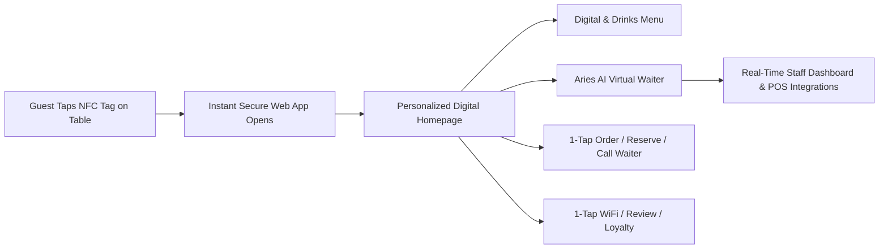

# Aries AI — Official Corporate Profile & Product Ecosystem

> **Tagline:** The Operating System for Modern Hospitality & Conversational AI  
> **Website:** [ariesai.in](https://ariesai.in) | **Contact:** [info@ariesai.in](mailto:info@ariesai.in) | **Support:** [support@ariesai.in](mailto:support@ariesai.in)

---

## 1. Executive Summary

**Aries AI** is an enterprise-grade technology ecosystem powering the next generation of hospitality and business communication across India. Built on cutting-edge artificial intelligence, cloud micro-architectures, and hardware-software integration, Aries AI operates two flagship platforms:

1. **Aries AI (WhatsApp & Conversational Automation):** Multi-tenant conversational AI SaaS powered by **Google Gemini 2.0 Flash** and direct **Official Meta WhatsApp Cloud API** integration, automating 24/7 customer engagement, lead scoring, drip marketing, and booking workflows.
2. **Aries Tap (Intelligent Hospitality OS):** A revolutionary NFC + AI physical space operating system that transforms every table in cafés, restaurants, lounges, and hotels into an intelligent, contactless digital concierge—requiring zero app downloads, zero logins, and zero user friction.

Together, these platforms unify disconnected hospitality tech (menus, POS, reviews, loyalty, WhatsApp, WiFi, payments) into a single, high-conversion digital ecosystem for modern venues.

---

## 2. Corporate Fact Sheet

| Key Indicator | Corporate Details |
| :--- | :--- |
| **Company Name** | Aries AI Technologies |
| **Flagship Ventures** | **Aries AI** (Conversational Messaging SaaS) <br> **Aries Tap** (AI + NFC Physical Hospitality OS) |
| **Co-Founders** | **Sakshay Ajwani** (Co-Founder & CTO) <br> **Kritika Mahendru** (Co-Founder & CEO) |
| **Academic Origin** | Manipal University Jaipur (MUJ) — B.Tech Engineering |
| **Company Status** | Production-Grade, Bootstrapped Enterprise SaaS & Hardware-Software Ecosystem |
| **Primary Industry** | Hospitality Tech / Conversational AI / NFC Hardware-SaaS / Marketing Automation |
| **Core Technology** | Next.js 16, Google Gemini 2.0 Flash + RAG, Official Meta WhatsApp Cloud API, Supabase, NFC (NTAG213/215/216) |
| **Featured Clients** | Tafetta Coffee House, LazyMojo Cafe, Chaat and Chutneys, The Magnolia Cafe, Mezo Jaipur, The Clock Tower |
| **Primary Market** | India (Hospitality, Cafés, Lounges, Hotels, E-Commerce, Real Estate, Healthcare) |
| **Official Website** | [https://ariesai.in](https://ariesai.in) |
| **General Inquiries** | [info@ariesai.in](mailto:info@ariesai.in) |
| **Technical Support** | [support@ariesai.in](mailto:support@ariesai.in) |
| **Operating Hours** | Mon – Sat, 9:00 AM – 7:00 PM IST (2-Hour SLA) |

---

## 3. Executive Leadership Team

### Sakshay Ajwani — Co-Founder & Chief Technology Officer
- **Executive Scope:** Platform Architecture, AI/NLU RAG Engineering, System Infrastructure & Hardware Integration.
- **Background:** 3rd Year B.Tech (Engineering) at Manipal University Jaipur (MUJ).
- **Core Contributions:** Architected the 0-to-100 system blueprint for both Aries AI and Aries Tap, including Gemini RAG vector search, NFC secure URL signing, multi-tenant Supabase RLS isolation, and distributed queue worker engines.

### Kritika Mahendru — Co-Founder & Chief Executive Officer
- **Executive Scope:** Corporate Strategy, Brand Partnerships, Enterprise Operations & Growth Strategy.
- **Background:** 3rd Year B.Tech (Engineering) at Manipal University Jaipur (MUJ).
- **Core Contributions:** Drives commercial execution, venue acquisition across hospitality hubs, client success operations, agency white-label partnerships, and corporate brand positioning.

---

## 4. Trusted Brand Client Portfolio

Aries AI and Aries Tap power physical and digital customer operations for premier cafes, luxury lounges, QSRs, and fine dining establishments:

```
+-----------------------------------------------------------------------------------+
|                            FEATURED BRAND PARTNERS                                |
+-----------------------------------------------------------------------------------+
|  ☕ Tafetta Coffee House    |   🍴 LazyMojo Cafe        |   🌶️ Chaat and Chutneys |
|  🌿 The Magnolia Cafe       |   🍸 Mezo Jaipur          |   🏛️ The Clock Tower    |
+-----------------------------------------------------------------------------------+
```

| Brand Partner | Industry Segment | Aries AI & Aries Tap Solution |
| :--- | :--- | :--- |
| **Tafetta Coffee House** | Specialty Coffee & Bistro | NFC table tap experience, WhatsApp digital menu sharing, and automated booking management. |
| **LazyMojo Cafe** | Casual Dining & Cafe | AI-powered table reservation engine, event/party booking automation, and instant feedback capture. |
| **Chaat and Chutneys** | Quick Service Restaurant (QSR) | Fast inquiry responses, multi-outlet routing, digital menu distribution, and automated customer support. |
| **The Magnolia Cafe** | Boutique Cafe & Bakery | Automated takeaway inquiries, custom cake/order consultations, and automated drip follow-ups. |
| **Mezo Jaipur** | Luxury Hospitality & Fine Dining | Premium AI concierge, VIP table reservations with advance commitment fees, and instant staff escalation. |
| **The Clock Tower** | Iconic Dining & Lounge Bar | Weekend table slot management, NFC DJ/event calendar engagement, and multi-channel lead tracking. |

---

## 5. Core Venture 1: Aries AI (Conversational & WhatsApp Business SaaS)

**Aries AI** transforms incoming messaging traffic on WhatsApp and Instagram into an automated sales and support engine.

### Key Capabilities
- **Google Gemini 2.0 Flash NLU Engine:** Free-form conversational comprehension supporting mixed **Hinglish, Hindi, and English** slang (*"bhai kal 4 baje table milega?"*).
- **Direct Meta Cloud API Integration:** Official Meta Cloud API v21.0 integration bypassing third-party BSP markup and latency.
- **Smart Lead Scoring & CTWA Ads Attribution:** Automatic classification into Hot/Warm/Cold leads with native Meta Click-to-WhatsApp ad attribution.
- **Automated Drip Follow-ups & Broadcasts:** Multi-touch automated message sequences (30m, 3h, 24h, 7d) via BullMQ worker queues and Meta template campaigns.
- **Shared Inbox & Human Escalation:** Real-time team inbox with one-click bot pause/resume and automatic sentiment-driven escalation.

---

## 6. Core Venture 2: Aries Tap (Intelligent Hospitality OS)

```
                       PHYSICAL SPACE + AI + NFC
                                  ↓
                        "JUST TAP" EXPERIENCE
                                  ↓
+-----------------------------------------------------------------------+
|  No App Download  |  No Registration  |  No Password Typing           |
+-----------------------------------------------------------------------+
```

### The Core Vision & Flow
1. **Physical Trigger:** Premium wooden or acrylic NFC tags installed on venue tables.
2. **Instant Tap:** Guests tap their smartphone (iOS or Android) on the tag.
3. **Instant Experience:** An Apple-grade, glassmorphic web application opens instantly—no app download, no signup, no login friction.



### Key Modules & Capabilities of Aries Tap

#### 1. Apple-Quality Digital & Drinks Menu
- High-definition photography, fluid animations, categories, dietary filters (Veg, Non-Veg, Vegan, Gluten-Free), variants, and chef recommendations.

#### 2. Aries AI Virtual Waiter (RAG-Powered)
- Guests interact with an AI assistant trained on the venue's exact menu, ingredients, allergens, wine pairings, and policies.
- Example Queries: *"Suggest a spicy pasta under ₹500"*, *"What wine pairs best with pizza?"*, *"What's gluten-free here?"*.
- **Zero-Hallucination Guardrails:** If information is missing, the AI states: *"I'll confirm that directly with our staff."*

#### 3. Table Operations & Service Triggers
- **Call Waiter / Bill Request:** Instant notification sent to staff dashboards or WhatsApp.
- **Table Booking & Online Ordering:** Direct table reservations, pickup, and takeaway flows.

#### 4. Reputation & Feedback Protection Engine
- **1-Tap Google Reviews:** Prompts happy guests to post positive Google reviews with AI-generated review suggestions.
- **Private Feedback Guard:** Directs negative experiences to a private feedback form, alerting management *before* negative reviews hit Google.

#### 5. Gamification & Loyalty Engine
- Digital stamp cards, spin-the-wheel rewards, scratch cards, visit streak tracking, and member discounts to boost repeat visits.

#### 6. Instant One-Tap WiFi & Event Hub
- Tapping connects guests to venue WiFi automatically without typing passwords.
- Displays live music, DJ nights, brunch schedules, and festival promotions.

#### 7. Hyper-Personalization Layer (Returning Guests)
- The system recognizes returning guests, dynamically adapting the homepage to highlight favorite dishes, visit history, loyalty tier, and birthday offers.

#### 8. Merchant Control Dashboard & CRM
- **NFC Fleet Management:** Track table numbers, branch status, tap counts, and secure URL signing (clone-prevention).
- **Restaurant CRM & Marketing Engine:** Automated customer database capturing every tap into actionable segments for WhatsApp/SMS/Email re-engagement.
- **POS & Ecosystem Integrations:** Architected for seamless integration with PetPooja, DotPe, UrbanPiper, Razorpay, Shopify, and Meta/Google APIs.

#### 9. Industry Vertical Adaptation
- **Cafés:** Fast coffee ordering, student loyalty, Instagram-worthy UX.
- **Lounges & Clubs:** DJ calendars, bottle service booking, VIP table reservations.
- **Hotels & Resorts:** In-room service, concierge AI, spa reservations, local attraction guides, express checkout.

---

## 7. Unified Technical Blueprint & Architecture

```
+-----------------------------------------------------------------------------------+
|                                ARIES TAP HARDWARE                                 |
|                 NTAG213 / NTAG215 / NTAG216 Secure Encrypted NFC Tags            |
+-----------------------------------------------------------------------------------+
                                         |
                                         v
+-----------------------------------------------------------------------------------+
|                                 FRONTEND LAYER                                    |
|          Next.js 16 (App Router) + React + TypeScript + Framer Motion              |
|                     Tailwind CSS (Glassmorphism / Dark Mode)                      |
+-----------------------------------------------------------------------------------+
                                         |
                                         v
+-----------------------------------------------------------------------------------+
|                             BACKEND & AI LAYER                                    |
|   Supabase (Postgres, RLS Isolation, Realtime) + Edge Functions                   |
|   Google Gemini 2.0 Flash + OpenAI RAG Vector Embeddings (Pgvector)               |
|   Dedicated Node.js BullMQ Worker + Upstash Redis (Caching & Queueing)            |
+-----------------------------------------------------------------------------------+
                                         |
                                         v
+-----------------------------------------------------------------------------------+
|                            INTEGRATIONS & OUTPUTS                                 |
|   Meta WhatsApp Cloud API | Razorpay | POS (PetPooja/UrbanPiper) | Google APIs    |
+-----------------------------------------------------------------------------------+
```

- **Security Standard:** Signed dynamic URLs, encrypted NFC tag identifiers, tenant RLS isolation, Redis IP rate-limiting, and HTTPS enforced across all endpoints.
- **Performance:** Cloudflare CDN edge caching and static image optimization ensure sub-second tap load times.

---

## 8. Commercial Models & Subscription Tiers

### A. Aries AI (WhatsApp Messaging SaaS)
*Includes 14-Day Free Trial + ₹100 trial credits. 10% discount on annual billing.*

* **Starter (₹3,999/mo):** 1 Agent Seat, 2,000 conversations/mo, basic FAQ bot.
* **Growth (₹5,999/mo):** 3 Seats, 10,000 conversations/mo, Hinglish/Hindi AI, auto drip follow-ups.
* **Pro (₹7,999/mo):** 5 Seats, 25,000 conversations/mo, Visual Flow Builder, CRM & API webhooks.
* **Ultra (Custom):** Unlimited conversations, dedicated AI model, Voice Agent, SLA & dedicated success manager.

### B. Aries Tap (NFC Hardware + Hospitality OS SaaS)
*Flexible subscription model with hardware setup + recurring monthly SaaS.*

* **Starter (₹999/mo + Setup Fee):** Core Digital Menu, NFC Table Tags, Basic Analytics, Google Review Module.
* **Growth:** Full AI Virtual Waiter, Call Waiter / Bill Request, WiFi Tap, Basic Loyalty Engine.
* **Pro:** Hyper-Personalization Engine, CRM & Marketing Engine (WhatsApp/SMS), POS Integrations, Gamification.
* **Enterprise / White-Label:** Custom branding, agency white-label portals, multi-branch governance, dedicated account manager.

---

## 9. Corporate Governance & Official Contacts

- **Corporate Website:** [https://ariesai.in](https://ariesai.in)
- **General & Enterprise Inquiries:** [info@ariesai.in](mailto:info@ariesai.in)
- **Technical Support:** [support@ariesai.in](mailto:support@ariesai.in)
- **Headquarters / Operational Base:** Manipal University Jaipur Campus / Online Platform
- **Support Operating Hours:** Monday – Saturday, 9:00 AM – 7:00 PM IST
