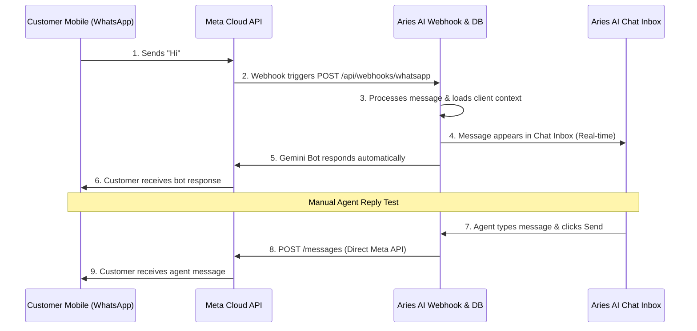

# Aries AI — Meta Direct Integration & Onboarding Guide (0 to 100)
This document is a comprehensive, step-by-step checklist to onboard a new client onto **Aries AI** using **Meta Cloud API Direct** (no BSP middlemen). 

Follow these steps in order to connect a new phone number, complete Meta verifications, link it to Aries AI, configure the webhook, and successfully send/receive test messages.

---

## 🔗 Quick Links Directory

Open these links in separate tabs as you go through the process:

| Portal | Purpose | Link |
| :--- | :--- | :--- |
| **Meta Developers** | Create Developer App & get App Secret | [developers.facebook.com/apps](https://developers.facebook.com/apps/) |
| **Meta Business Settings** | Manage users, assets, and security | [business.facebook.com/settings](https://business.facebook.com/settings) |
| **Meta Security Center** | Start Meta Business Verification | [business.facebook.com/settings/security](https://business.facebook.com/settings/security) |
| **Meta WhatsApp Manager** | Manage phone numbers, templates, quality | [business.facebook.com/wa/manage](https://business.facebook.com/wa/manage/) |
| **Aries AI Login** | Client's main dashboard | [ariesai.in/login](https://ariesai.in/login) |
| **Aries AI Settings** | Insert API credentials & parameters | [ariesai.in/dashboard/settings](https://ariesai.in/dashboard/settings) |
| **Supabase Dashboard** | Back-end database configuration | [app.supabase.com](https://app.supabase.com) |

---

## 🛠️ Step-by-Step Onboarding Workflow

### Phase 1: Phone Number Preparation
Meta's Cloud API does not allow phone numbers that are currently active on WhatsApp consumer apps (regular WhatsApp or WhatsApp Business app).
1. **Prepare a Number:** Obtain a new SIM or choose a number that will be dedicated strictly to the Business API.
2. **If the number is already active on WhatsApp:**
   - You **MUST** delete the WhatsApp account first.
   - Open WhatsApp on the mobile phone → Go to **Settings** → **Account** → **Delete my account** (or **Delete Account**).
   - Verify by typing the phone number in full international format, then tap **Delete Account**.
   - Uninstall the app from the device.
   - > [!IMPORTANT]
     > Deleting the account is irreversible. All chat history on that app will be wiped. This is required; otherwise, Meta's verification OTP will fail.

---

### Phase 2: Create Meta Developer App (0 to 50)
1. Navigate to the [Meta for Developers Dashboard](https://developers.facebook.com/apps/).
2. Log in with the **client's personal Facebook account** (or the admin Facebook account representing their business).
3. Click the green **Create App** button.
4. **Choose app details:**
   - **App Type:** Select **Other** -> Click **Next**.
   - **App Category:** Select **Business** -> Click **Next**.
   - **App Name:** Enter a recognizable name, e.g., `Aries AI - [Client Name]`.
   - **Business Account:** Select the client's **Meta Business Account** (if they do not have one, let Meta create a new business portfolio right here).
   - Click **Create App**.
5. **Add WhatsApp Product:**
   - Under the App Dashboard, scroll down to **Add products to your app**.
   - Find **WhatsApp** and click **Set Up**.
   - Click **Continue** to agree to terms. This automatically creates a linked WhatsApp Business Account (WABA).

---

### Phase 3: Phone Number API Setup & OTP (50 to 70)
1. In the left-hand menu of your Meta Developer App, click **WhatsApp** → select **API Setup** (or **Getting Started**).
2. Scroll down to **Step 5: Add a phone number** and click **Add phone number**.
3. **Fill in the WhatsApp Business Profile:**
   - **WhatsApp business profile display name:** Enter the client's public display name (e.g. `Zara Restaurant`).
   - **Category:** Select their industry category.
   - **Timezone:** Select local timezone (e.g., GMT+05:30).
   - Click **Next**.
4. **Enter Phone Number:**
   - Input the phone number without the country code prefix (select the country code from the dropdown, e.g., India +91).
   - Select verification method: **Text Message** or **Phone Call**.
   - Click **Next**.
5. **Verify with OTP:**
   - Input the 6-digit OTP code received via SMS or call on that number.
   - Click **Finish**.
6. **Note Down Credentials:** On the **API Setup** screen, copy and save these two crucial values:
   - **Phone Number ID** (`wa_phone_number_id`)
   - **WhatsApp Business Account ID** (`wa_business_account_id`)

---

### Phase 4: Generate Permanent System User Token (70 to 85)
The temporary token generated on the API Setup page expires after 24 hours. To run Aries AI continuously, you must generate a permanent token.
1. Navigate to [Meta Business Settings](https://business.facebook.com/settings).
2. Select the correct **Business Portfolio** matching your app.
3. In the left sidebar, click **Users** → **System Users**.
   - Direct Link: [Meta System Users](https://business.facebook.com/settings/system-users)
4. Click **Add** to create a new System User.
   - **System User Name:** `aries-bot-user`
   - **System User Role:** Select **Admin** (required for token generation).
   - Click **Create System User**.
5. **Assign WhatsApp Assets:**
   - Under the newly created System User, click **Add Assets**.
   - Select **WhatsApp Accounts** in the left column.
   - Select the client's WhatsApp Business Account.
   - Toggle **Full Control** (Manage WhatsApp account) to **ON**.
   - Click **Save Changes**.
6. **Generate the Permanent Access Token:**
   - Click **Generate New Token** under the System User page.
   - Select the App created in Phase 2 from the dropdown.
   - Check the boxes for the following two scopes:
     - [x] `whatsapp_business_messaging`
     - [x] `whatsapp_business_management`
   - Click **Generate Token**.
   - > [!WARNING]
     > Copy this token immediately and store it securely (e.g. in your password manager). Meta will never show this token to you again. This token is your `wa_access_token`.

---

### Phase 5: Complete Meta Business Verification (85 to 95)
WhatsApp Business accounts have a messaging limit limit unless the business is verified.
1. Navigate to the [Meta Security Center](https://business.facebook.com/settings/security).
2. Under **Business Verification**, click **Start Verification**.
3. **If "Start Verification" is greyed out (The App Developer Trick):**
   - Go back to [Meta Apps](https://developers.facebook.com/apps/) → Select your app.
   - Go to **Settings** → **Basic** on the left menu.
   - Fill in: **Privacy Policy URL**, **Terms of Service URL**, upload an **App Icon**, and choose a **Category**.
   - Click **Save changes**.
   - Refresh the [Security Center](https://business.facebook.com/settings/security) page; the **Start Verification** button will now be enabled.
4. **Submit Verification Documents:**
   - Upload official documents showing:
     1. **Legal Business Name:** GST Certificate, Certificate of Incorporation, or Udyam Aadhar matching the name entered in Meta Business settings.
     2. **Business Address:** Utility bill (electricity, water, internet) or bank statement containing the exact same business name and address.
   - Confirm via phone call or business email. Approval typically takes 1–3 business days.
5. **Verify Display Name Status:**
   - Navigate to [WhatsApp Manager -> Phone Numbers](https://business.facebook.com/wa/manage/phone-numbers).
   - Make sure the display name status is approved.

---

### Phase 6: Connect Credentials to Aries AI (95 to 100)
1. Go to [Aries AI Login](https://ariesai.in/login) and sign in.
2. Go to **Settings** → **WhatsApp Integration** page.
3. Fill in the Meta details you collected:
   - **Phone Number ID:** Paste `wa_phone_number_id` (from Phase 3)
   - **Access Token:** Paste the permanent `wa_access_token` (from Phase 4)
   - **WhatsApp Business Account ID:** Paste `wa_business_account_id` (from Phase 3)
   - **App Secret:** Go to [Meta Developers](https://developers.facebook.com/apps/) → Select your app → **Settings** → **Basic** → Click "Show" next to **App Secret** → copy and paste it here.
   - **Verify Token:** Create a secure, random string (e.g. `aries_verify_token_[client_name]_2026`) and paste it here.
4. Click **Save Settings** (which encrypts the access token and app secret at-rest).

---

### Phase 7: Configure Webhooks on Meta Portal
To route customer replies from WhatsApp to Aries AI:
1. Go back to [Meta Developers App Dashboard](https://developers.facebook.com/apps/) → select your App.
2. In the left menu under **WhatsApp**, click **Configuration**.
3. Next to **Webhook**, click **Edit**.
4. **Enter Webhook Details:**
   - **Callback URL:** `https://ariesai.in/api/webhooks/whatsapp`
   - **Verify Token:** Paste the exact secure string you defined in Aries AI Settings (from Phase 6, step 3).
5. Click **Verify and Save**.
6. **Subscribe to Webhook Fields:**
   - Next to Webhook fields, click **Manage**.
   - Find the row named **`messages`** and click **Subscribe** (very important, this fires when a user replies!).
   - Click **Done**.

---

### Phase 8: End-to-End Live Testing
Verify both sending and receiving:

#### Test 1: Inbound Message & AI Auto-Reply
1. Open WhatsApp on your personal phone.
2. Send a greeting (e.g., "Hi, what are your opening hours?") to the client's new WABA phone number.
3. Open [Aries AI Inbox](https://ariesai.in/dashboard/chat).
4. **Verify:**
   - [ ] The conversation appears in the inbox in real-time.
   - [ ] The AI bot automatically responds to the customer within 5–10 seconds based on the client's business profile.
   - [ ] The lead is saved in the **Leads** tab.

#### Test 2: Outbound Agent Messaging
1. In the [Aries AI Inbox](https://ariesai.in/dashboard/chat), select the active test conversation.
2. Type a message in the text input area (e.g., "Hello, this is a manual test from the agent dashboard.") and click **Send**.
3. **Verify:**
   - [ ] The message status updates to `sent` -> `delivered` (double checkmark).
   - [ ] The message arrives on your personal phone's WhatsApp.

---

## ⚠️ Troubleshooting Onboarding Blockers

| Symptom | Probable Cause | Quick Resolution |
| :--- | :--- | :--- |
| **No verification OTP arrives** | Number is still active on WhatsApp consumer/business app. | Delete the account from the mobile app (Settings > Account > Delete Account). Uninstall app, retry. |
| **Verify Webhook fails on Meta Portal** | Verify Token mismatch or Webhook server offline. | Check that the string in Meta Webhook config matches the `wa_verify_token` in Aries AI dashboard. Check server logs on `/api/webhooks/whatsapp`. |
| **Bot doesn't auto-reply** | 1. Webhook `messages` event not subscribed. 2. Incorrect Access Token. | 1. Go to Meta App → WhatsApp → Configuration → Manage Webhook Fields → Subscribe to `messages`.  2. Re-generate permanent token in Meta System Users and save again in Aries AI. |
| **"Start Verification" disabled** | Meta App is missing privacy settings or category details. | Go to Meta App Dashboard → Settings → Basic. Add a valid Privacy Policy URL, App Icon, and Category. Save and reload Security Center. |
| **Outbox messages fail to send** | Permanent token lack of permissions. | Re-generate the System User token, ensuring you check **both** `whatsapp_business_messaging` and `whatsapp_business_management`. |
